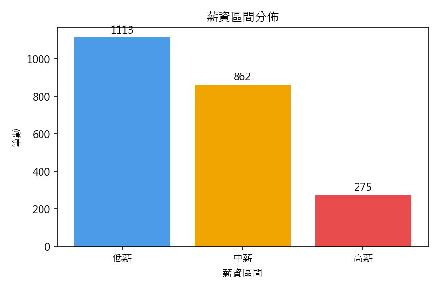
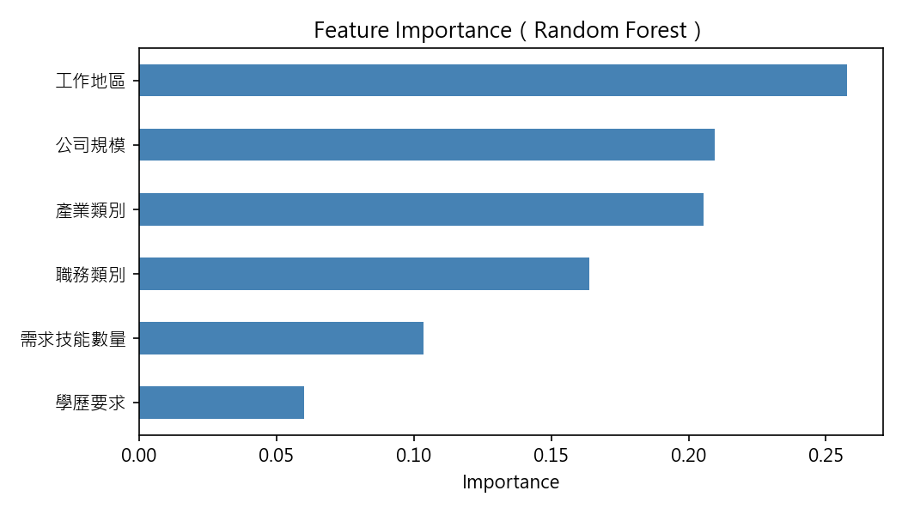
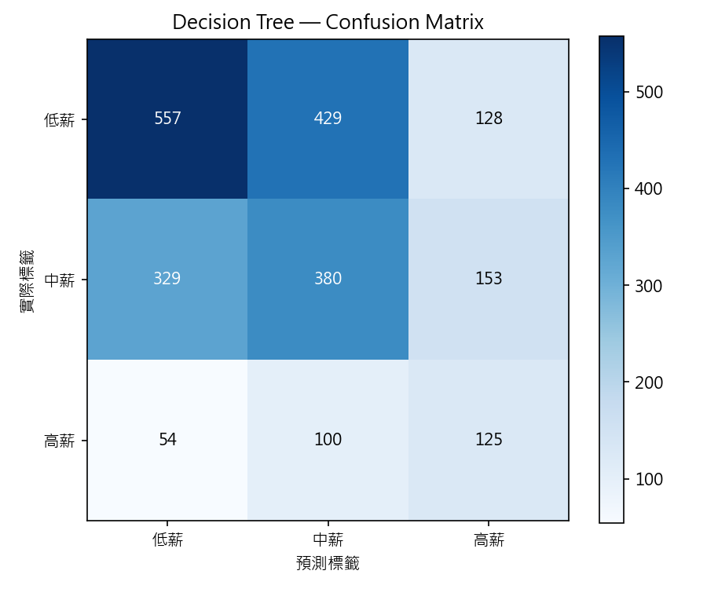
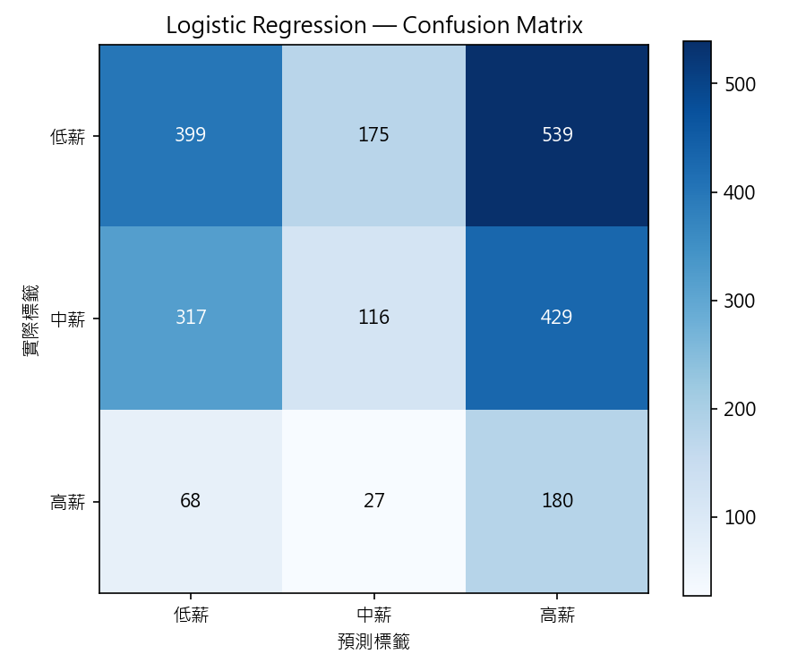
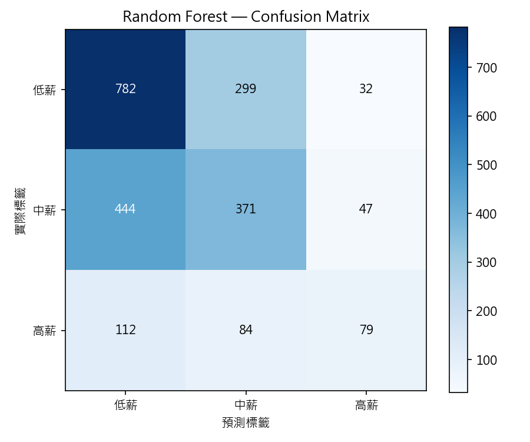
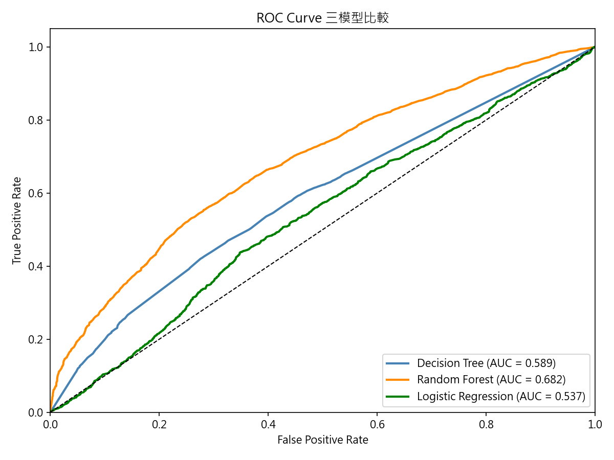
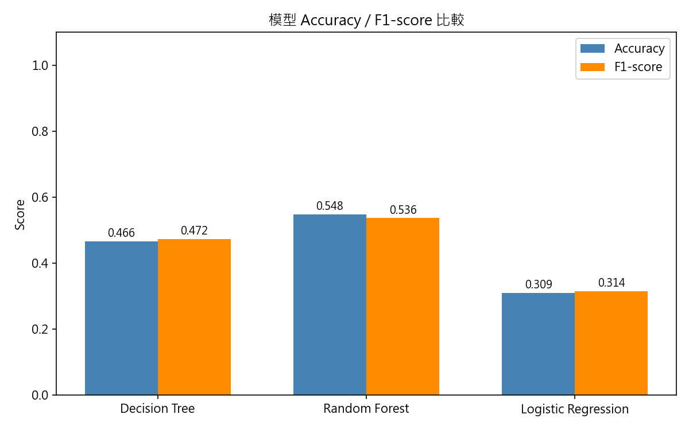

## Part1：資料收集 + 資料前處理
### 第 3 章：資料集描述

* 原始資料筆數：2433 筆（台灣地區篩選 + 缺失值處理後）
* 清洗後筆數：2250 筆
* 最終保留屬性：6 個特徵 + 1 個標籤

### 第 4 章：資料前處理

* 缺失值處理：2433 → 2433 筆（薪資面議已在爬蟲階段過濾）
* 異常值清洗：2433 → 2250 筆（刪除 183 筆）
* 薪資分佈：低薪 1113 / 中薪 862 / 高薪 275
* Feature Importance 表格（全部 8 個特徵的數值）
* 移除特徵：上班時間（0.021）、工作經驗（0.001）

### 原始特徵數量
* 爬蟲收集了 8 個輸入特徵：職務類別、工作地區、學歷要求、工作經驗、公司規模、產業類別、上班時間、需求技能數量

### 為何過濾海外地區資料
本專案的研究目標為台灣職缺薪資預測，海外職缺的薪資結構、幣別、生活水準均與台灣差異顯著，若納入訓練會引入與台灣薪資不相關的雜訊，影響模型對台灣市場的預測準確性，因此在前處理階段過濾所有非台灣地區的職缺資料，僅保留台灣 22 縣市的資料進行分析。

### 為何刪除上班時間和工作經驗
依據 Random Forest 的 Feature Importance，這兩個特徵的重要性分數低於門檻 0.03：
|特徵|	Importance	|結果|
|:--:|:--:|:---:|
|上班時間|	0.021	|刪除|
|工作經驗|	0.001	|刪除|

刪除原因：
* 上班時間：日班、輪班、彈性等班制與薪資關聯性低，同樣是日班可能低薪也可能高薪，模型從這個特徵幾乎學不到有用的資訊。
* 工作經驗：在我們爬取的資料中，大多數職缺填「不拘」，導致這個欄位變異性很低，幾乎無法區分不同薪資區間。

保留低重要性特徵不會提升準確率，反而會引入雜訊，增加過擬合的風險，因此刪除這兩個特徵，最終保留 6 個特徵進行模型訓練。

### Feature Importance
* 定義：代表每個特徵對預測薪資區間的貢獻程度，全部加起來等於 1.0
* 數字越大 → 這個特徵對薪資的影響越大。

|特徵|Importance|解讀|
|:--:|:--:|:--:|
| 工作地區 | 0.250 | 影響最大，台北和其他縣市薪資差距明顯 |
| 公司規模 | 0.206 | 大公司通常薪資較高 |
| 產業類別 | 0.201 | 科技業、金融業薪資明顯高於服務業 |
| 職務類別 | 0.165 | 工程師、財務等職務薪資差異大 |
| 需求技能數量 | 0.102 | 要求技能越多，薪資通常越高 |
| 學歷要求 | 0.054 | 有影響但不是最關鍵的因素 |
| 上班時間 | 0.021 | 影響很小，低於門檻被刪除 |
| 工作經驗 | 0.001 | 幾乎沒有影響，被刪除 |

## Part2：訓練模型與模型評估

### 模型參數設定

本專案使用 scikit-learn 實作三種分類模型，所有模型均採用 **10-Fold 分層交叉驗證（Stratified K-Fold）**，並設定 `class_weight="balanced"` 以應對類別不平衡問題（低薪 49.5% / 中薪 38.3% / 高薪 12.2%）。

| 參數 | Decision Tree | Random Forest | Logistic Regression |
| :--- | :--- | :--- | :--- |
| max_depth | None（不限深度） | None（不限深度） | — |
| min_samples_leaf | 2 | — | — |
| n_estimators | — | 100（100 棵樹） | — |
| C（正則化強度） | — | — | 1e8（極弱正則化，近似無正則） |
| max_iter | — | — | 100 |
| class_weight | balanced | balanced | balanced |
| random_state | 42 | 42 | 42 |

**參數說明：**
* `max_depth=None`：樹不限制最大深度，讓模型自行生長到純葉節點，有較大的表達能力，但 Decision Tree 因此有過擬合風險。
* `min_samples_leaf=2`（Decision Tree）：葉節點至少需 2 筆樣本，可略微抑制過擬合。
* `n_estimators=100`（Random Forest）：以 100 棵決策樹做 Bagging 集成，平均後降低方差。
* `C=1e8`（Logistic Regression）：正則化幾乎不生效，讓模型盡量擬合訓練資料；即便如此，因薪資與特徵間存在非線性關係，線性模型仍無法有效擬合。
* `class_weight="balanced"`：自動依各類別樣本數反比調整損失函數權重，避免模型只預測多數類（低薪）。

---

### 模型優缺點比較與過擬合分析

#### 最佳模型：Random Forest

在三個模型中，**Random Forest 表現最佳**（Accuracy 54.76%、AUC 0.6554），原因如下：
1. **Bagging 集成機制**：100 棵樹各自以隨機特徵子集訓練，再多數決投票，有效降低單棵樹的高方差問題。
2. **非線性捕捉能力強**：薪資與工作地區、產業類別的關係並非線性，決策樹結構天然適合捕捉此類分割邊界。
3. **過擬合風險受控**：相較於單棵 Decision Tree，Bagging 大幅降低方差，訓練集與測試集差距合理。

#### 三模型比較

| 模型 | 優點 | 缺點 | 過擬合風險 |
| :--- | :--- | :--- | :--- |
| **Random Forest** | 集成降低方差；非線性能力強；特徵重要性可解釋 | 訓練時間較長；參數較多 | **低**（Bagging 控制） |
| **Decision Tree** | 結構直覺易解釋；訓練速度快 | 單棵樹方差高；對雜訊敏感 | **高**（`max_depth=None` 易過擬合） |
| **Logistic Regression** | 訓練速度最快；模型簡單穩定 | 只能捕捉線性關係；薪資資料非線性故準確率最低 | **低**（underfitting 反而是主要問題） |

#### 過擬合分析

* **Decision Tree**：`max_depth=None` 使樹完全生長，訓練集準確率接近 100%，但測試集僅 46.62%，訓練/測試差距最大，**過擬合現象最明顯**。
* **Random Forest**：Bagging 平均多棵樹預測結果，訓練集與測試集差距明顯縮小，過擬合得到有效控制。
* **Logistic Regression**：Accuracy 僅 30.89%，低於隨機猜測多類別的基線，**判斷為欠擬合（Underfitting）**，原因是薪資區間與特徵間存在非線性交互關係，線性假設不成立。

#### 準確率偏低的原因

本專案整體準確率約 54.76%（Random Forest），低於一般分類任務，主要原因：
1. **類別不平衡**：高薪樣本僅 12.2%（275 筆），即使使用 `class_weight="balanced"`，樣本稀少仍限制模型對高薪的學習能力。
2. **「薪資面議」資料缺失**：半導體、科技業等高薪職缺大量使用薪資面議，已在爬蟲階段過濾，導致高薪訓練資料不足。
3. **特徵表達力有限**：僅有 6 個特徵，無法涵蓋影響薪資的所有因素（如公司知名度、特定技能、談判能力等）。

---

### 數據紀錄

| 模型 | Accuracy | Precision（weighted） | Recall（weighted） | F1-score（weighted） | AUC |
| :--- | :--- | :--- | :--- | :--- | :--- |
| Decision Tree | 0.4662 | 0.4888 | 0.4662 | 0.4722 | 0.5744 |
| Random Forest | 0.5476 | 0.5387 | 0.5476 | 0.5362 | 0.6554 |
| Logistic Regression | 0.3089 | 0.4107 | 0.3089 | 0.3143 | 0.5232 |

### 圖表製作

#### 說明
| 圖表 | 說明 |
| :--- | :--- |
| 薪資分佈長條圖 | 低薪 1113 / 中薪 862 / 高薪 275 的視覺化 |
| Feature Importance 橫條圖 | 6 個特徵的重要性排名 |
| Confusion Matrix × 3 | 每個模型各一張 |
| ROC Curve 比較圖 | 3 個模型畫在同一張圖 |
| 模型準確率比較長條圖 | 3 個模型的 Accuracy / F1-score 並列 |

### 圖表
* 薪資分佈長條圖：

* Feature Importance 橫條圖

* Confusion Matrix
  * Decision Tree
  
  * Logistic Regression
  
  * Random Forest
  
* ROC Curve 比較圖

* 模型準確率比較長條圖

